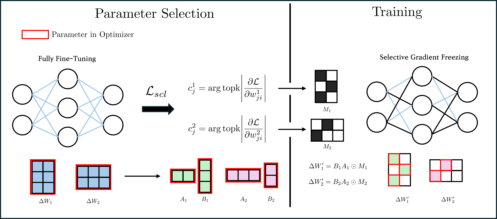

## Masking Low-Rank Matrix Multiplications for Memory Efficiency
---
### Introduction
This repository contains the implementation of a project based on the ["Gradient-based Parameter Selection for Efficient Fine-Tuning"](https://arxiv.org/abs/2312.10136) and ["Expanding Sparse Tuning for Low Memory Usage"](https://arxiv.org/abs/2411.01800). We propose an approach called MoRaM (**M**asking L**o**w-**Ra**nk Matrix **M**ultiplication) to improve memory efficiency compared to the original approach(GPS)


---
### Installation
```bash
git clone https://github.com/Jwonno/MoRaM.git
cd ./MoRaMM
conda create -n moram python=3.8
pip install -r requirements.txt
```

### Usage
```bash
for script in ./train_scripts/*.sh; do bash "$scripts"; done
```
